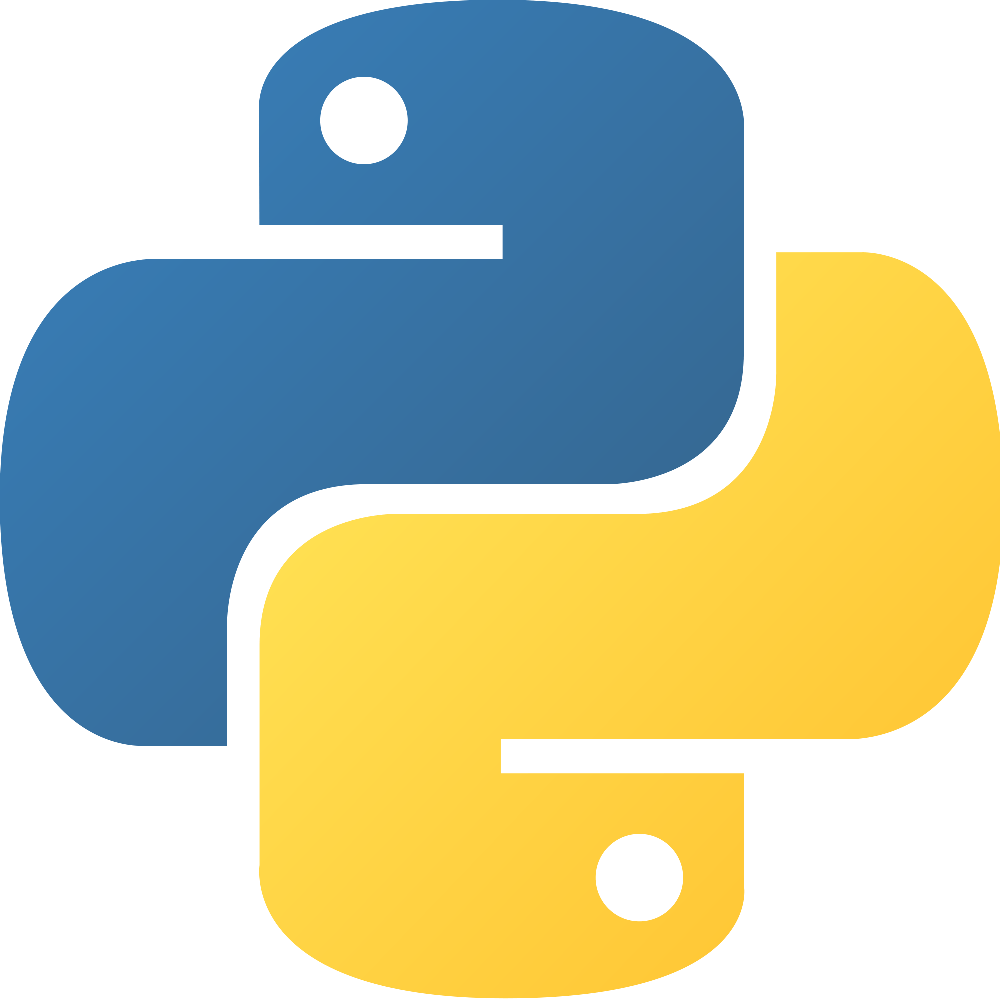

# MLForEveryone

A series of tutorials on learning Machine Learning using the Python programming language, for everyone!

#### Image Credit: https://towardsdatascience.com/machine-learning-algorithms-in-laymans-terms-part-1-d0368d769a7b

