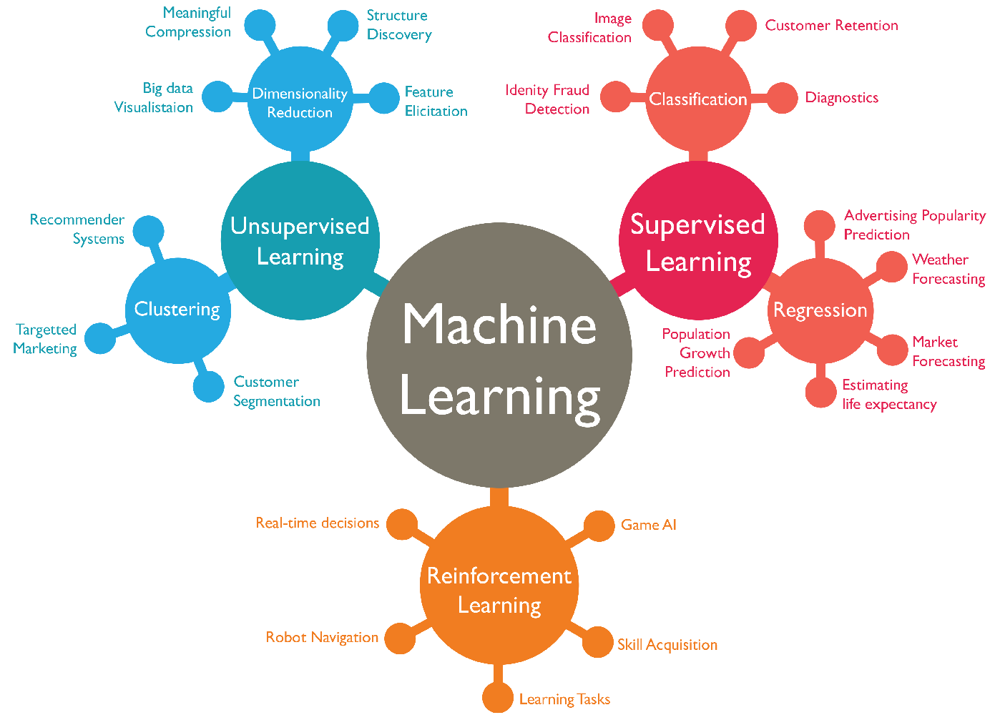

<div align="center">

# MLForEveryone
[](https://www.python.org/downloads/release/python-380/)

A series of tutorials on learning Machine Learning using the Python programming language, for everyone!




Image Credit: [Towards Data Science](https://towardsdatascience.com/machine-learning-algorithms-in-laymans-terms-part-1-d0368d769a7b)

</div>

## Course objectives

By the end of this course, one will:
1. Master the fundamentals of writing Python scripts
2. Gain an understanding of the fundamental concepts in machine learning
3. Employ Python to train machine learning models using either supervised learning, unsupervised learning, or reinforcement learning

## Tutorials

To begin this course, as desired, open up the Jupyter notebooks in the `notebook_tutorials` directory. For example, currently you can choose from:

<a href="https://colab.research.google.com/github/amorehead/MLForEveryone/blob/main/notebook_tutorials/Introduction_to_Python.ipynb" target="_blank">Introduction to Python</a>

<a href="https://colab.research.google.com/github/amorehead/MLForEveryone/blob/main/notebook_tutorials/Introduction_to_Machine_Learning.ipynb" target="_blank">Introduction to Machine Learning</a>

<a href="https://colab.research.google.com/github/amorehead/MLForEveryone/blob/main/notebook_tutorials/Introduction_to_Deep_Reinforcement_Learning.ipynb" target="_blank">Introduction to Deep Reinforcement Learning</a>

## Capstone Project

This course includes a capstone project to give students the opportunity to apply the knowledge they have acquired in an exciting setting, development of video game agents using deep reinforcement learning. The project currently available to students is as follows.

### MineRL

<a href="https://minerl.io/" target="_blank">MineRL</a> (pronounced like "mineral") is a Python package that allows one to develop intelligent software agents to play Minecraft, a popular sandbox video game available on a variety of platforms. Below are instructions for how to install MineRL on a machine running the Windows operating system.

#### Installation

##### Downloading and customizing required software
1. Install <a href="https://www.python.org/ftp/python/3.8.10/python-3.8.10-amd64.exe" target="_blank">Python 3.8</a> (if not done previously)
2. Install <a href="https://www.anaconda.com/" target="_blank">Anaconda</a> (if not done previously)
3. Install <a href="https://www.git-scm.com/" target="_blank">Git for Windows</a> (if not done previously)
4. Set up Anaconda access inside Git Bash using <a href="https://discuss.codecademy.com/t/setting-up-conda-in-git-bash/534473" target="_blank">this guide</a>
5. Install <a href="https://www.oracle.com/java/technologies/downloads/#java8-windows" target="_blank">Oracle's JDK 8</a>
6. Add `C:\Program Files\Java\jdk1.8.0_341\bin` and `C:\Program Files\Git\bin` to the top of your system's PATH variable accessible via `Advanced System Settings`

##### Creating and configuring a local Conda environment

Now, create and configure your Conda environment:

```bash
# Set up Conda environment locally
conda create --name MLForEveryone python=3.8

# Activate Conda environment located in the current directory:
conda activate MLForEveryone

# Install MineRL as a Python package inside your new `MLForEveryone` Conda environment
pip install git+https://github.com/minerllabs/minerl@v1.0.0
```
